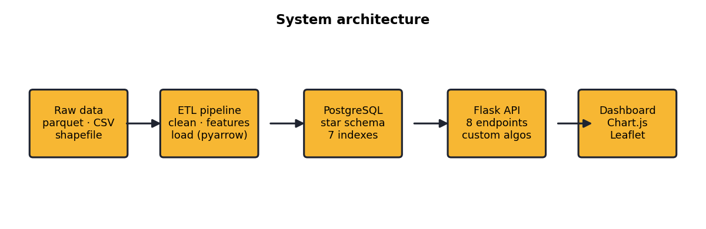

#NYC YELLOW TAXI EXPLORER - TECHNICAL REPORT

**January 2019 . 7.31M cleaned trips**
> This is the readable source of the report. The submission PDF is
> `docs/report.pdf`, regenerated from real run figures with
> `python docs/build_report.py`.

## 1. Problem Framing and Dataset Analysis

The dataset is the NYC Taxi & Limousine Commission (TLC) Yellow Taxi record for
January 2019: **7,696,617** raw trips across 18 fields, joined to
`taxi_zone_lookup` (263 zones) and a zone boundary shapefile. The raw files form
a fact/dimension environment — trip-level facts plus categorical and spatial
dimensions. We integrated them in a streaming pipeline: trip parquet is read in
200k-row batches, enriched, and bulk-loaded; zone polygons are reprojected
(EPSG:2263 → WGS84) into the zone dimension.

**Data integrity.** Eight rules removed **390,723** records (5.1%). Thresholds
reflect physical and contractual limits: trip duration 1–720 min, distance
0.1–100 mi, fare \$0.01–\$500, average speed ≤ 80 mph, passengers 1–6, and
pickup timestamp within the month. Duplicates and rows missing critical fields
were dropped; out-of-spec categorical codes (e.g. VendorID 4, RatecodeID 99)
were preserved where legitimate and otherwise coerced to NULL so foreign keys
hold.

| Exclusion rule | Records |
|---|---:|
| unknown_location_id | 187,558 |
| implausible_passenger_count | 117,438 |
| implausible_duration | 94,303 |
| implausible_distance | 71,145 |
| implausible_fare | 9,804 |
| implausible_speed | 6,556 |
| pickup_outside_month | 537 |
| implausible_total | 30 |
| **TOTAL excluded (5.1%)** | **390,723** |

**Unexpected observation.** The single largest exclusion bucket (**187,558**
trips) was *unknown location IDs* — codes 264/265, which the TLC uses for
"Unknown" and trips leaving the zone system. These have no polygon in the
shapefile. This directly shaped two design choices: the choropleth had to
tolerate zones with no matching trips, and spatial analysis excludes these rows
rather than mapping them to a fake location. A second surprise — 117,438 trips
with `passenger_count = 0` — is a known meter/data-entry artifact and was
likewise excluded.

## 2. System Architecture and Design Decisions

**Stack.** A Python ETL (pandas + pyarrow, streamed in batches and loaded with
PostgreSQL COPY) keeps cleaning and loading in one language and never holds the
full 7.7M rows in memory. **PostgreSQL** was chosen over SQLite for real
indexing and referential integrity at this scale. **Flask** serves both the JSON
API and the static dashboard, so there is a single process to run. The frontend
is vanilla **HTML/CSS/JS** with Chart.js and Leaflet — matching the brief
literally while letting Leaflet render the zone GeoJSON as an interactive
choropleth.

**Schema.** A star schema centers on `fact_trip` with four dimensions (zone,
vendor, rate code, payment type). Seven indexes target the dashboard's filter
patterns (pickup time, pickup/dropoff zone, hour, fare, distance, payment). The
hour / day-of-week / weekend keys are denormalized onto the fact table — a
deliberate storage-for-speed trade-off that turns the most common group-bys into
single-column scans. Zone geometry is stored as JSONB and also emitted once as a
static GeoJSON file the map loads directly.

**Trade-offs.** Chunked streaming trades a little speed for bounded memory; COPY
over per-row INSERT trades flexibility for a ~50× load speedup; coercing unknown
categorical IDs to NULL trades completeness for guaranteed integrity; and
excluding 5% of rows trades coverage for a clean, defensible analytic base.

